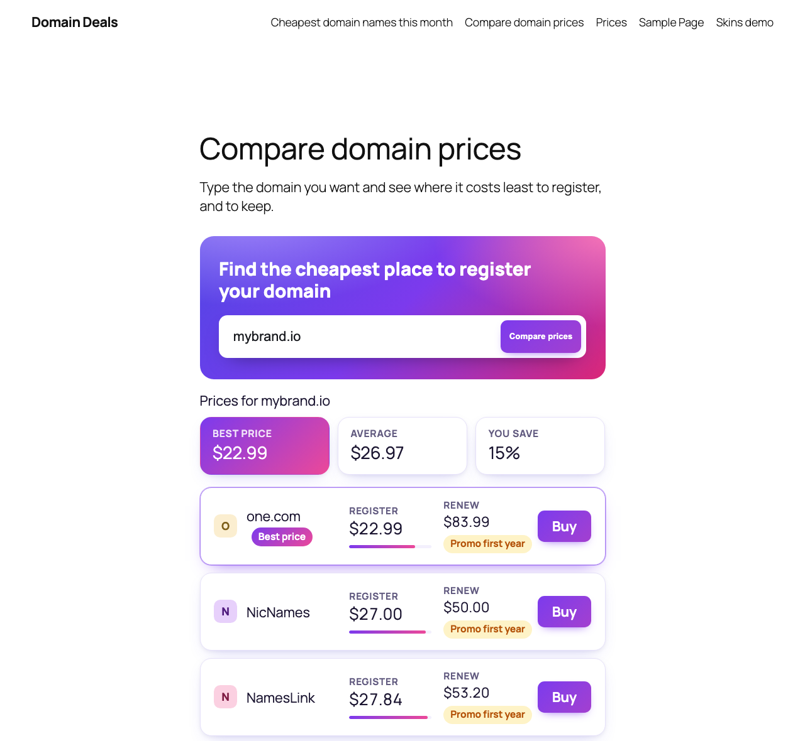
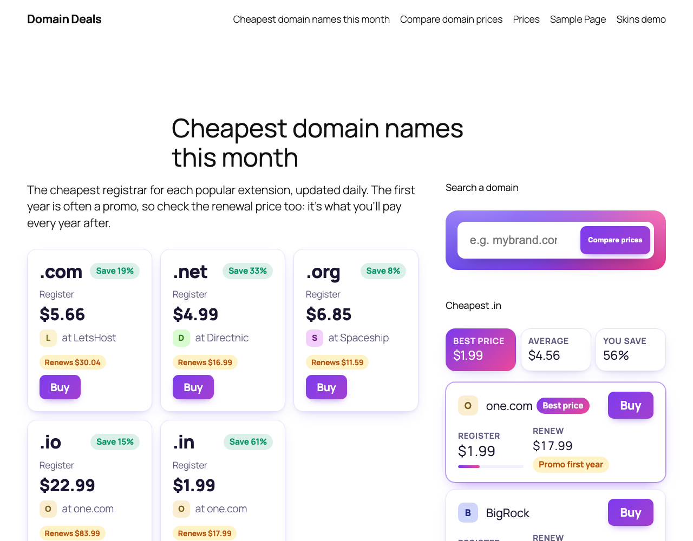
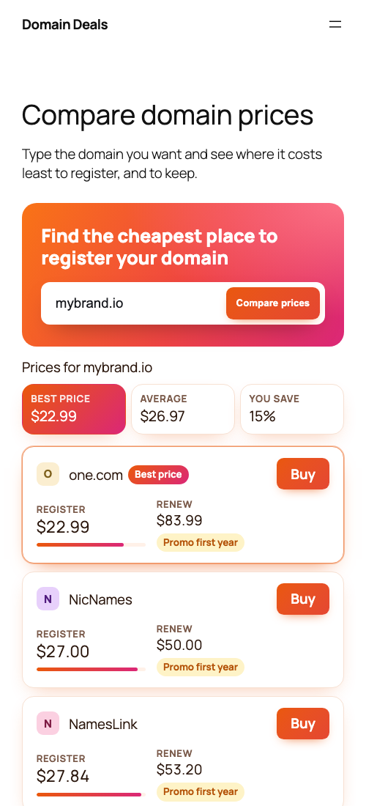
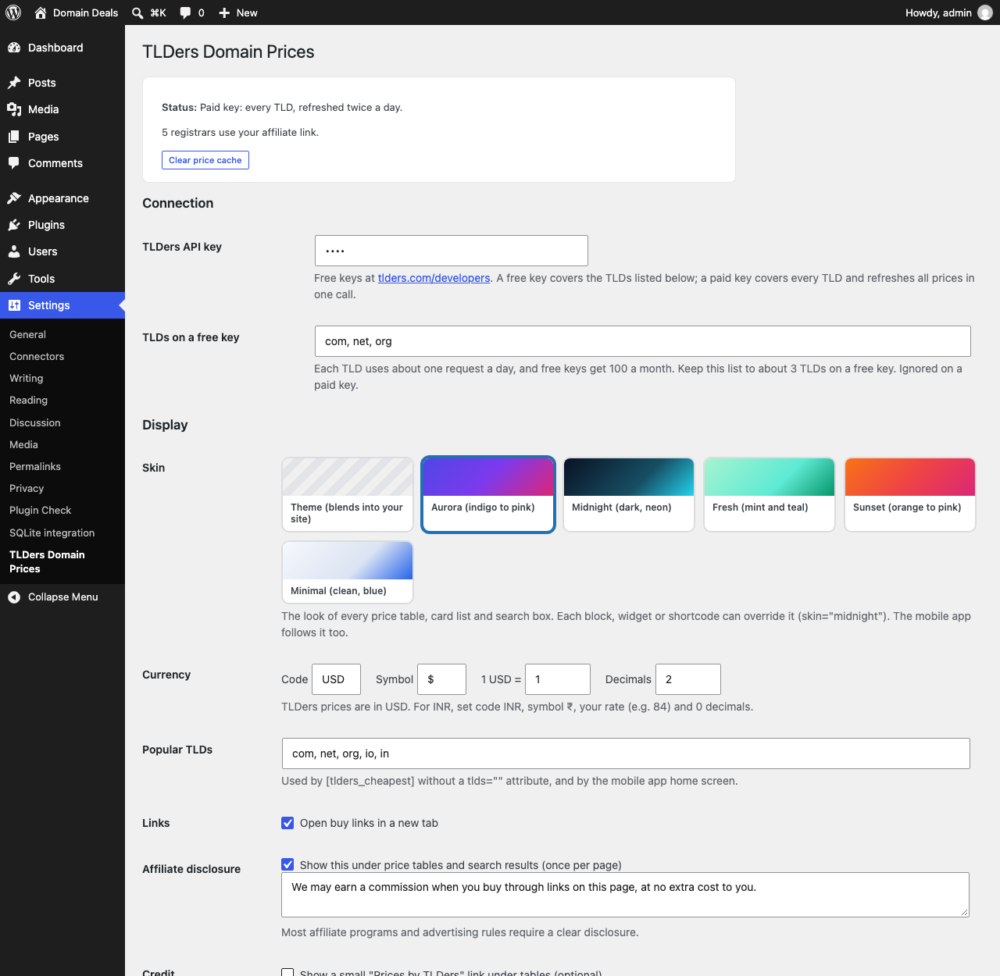
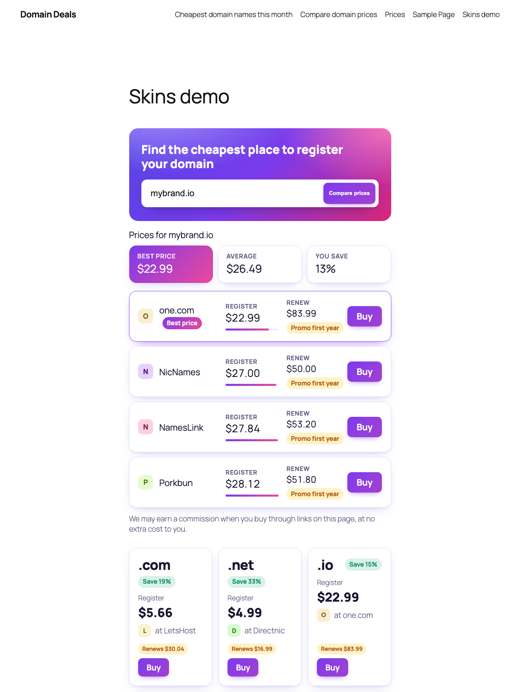

# TLDers Domain Prices for WordPress

Add domain price comparison to your WordPress site and **earn affiliate commissions
with your own registrar links**. Prices for register, renew and transfer come from
[TLDers](https://www.tlders.com), which tracks 145+ registrars and 1,100+ extensions
and refreshes daily.

- **Your affiliate links.** Paste your link for each registrar you've joined. Every Buy button for that registrar uses it.
- **A block, a widget and shortcodes.** Put prices in posts, pages, sidebars and block-theme widget areas.
- **A domain search box.** Visitors type `mybrand.com` and see where it's cheapest to register.
- **Any currency.** Show prices in INR, EUR or any other currency at your own rate.
- **Six skins.** Theme (blends into your site), Aurora, Midnight, Fresh, Sunset and Minimal, set site-wide or per block.
- **Smart extras.** Registrar avatars, a "Best price" badge, savings against the average, price bars and promo-renewal warnings.
- **Fast.** Prices are cached on your server and refreshed in the background twice a day.

[](https://wordpress.org)
[](https://www.php.net)
[](LICENSE)

| Domain search (Aurora) | Extension cards + sidebar | On phones (Sunset) |
|---|---|---|
|  |  |  |

| Settings and skin picker | Mixing skins (Aurora + Midnight) |
|---|---|
|  |  |

## Install

**From WordPress:** go to Plugins → Add New, search for *TLDers Domain Prices*, then click Install and Activate.

**From GitHub:** download the latest zip from [Releases](https://github.com/TLDers/tlders-domain-prices-wordpress/releases),
then go to Plugins → Add New → Upload Plugin. You can also clone this repository into `wp-content/plugins/tlders-domain-prices`.

Then:

1. Go to **Settings → TLDers Domain Prices** and paste your TLDers API key.
   Get one at [tlders.com/developers](https://www.tlders.com/developers).
2. Under **Your affiliate links**, paste your link for each registrar you're signed up with.
3. Add the **Domain Prices** block, the **TLDers Domain Prices** widget, or a shortcode.

## Show prices

### Block

In the block editor, add **Domain Prices**. It works in posts and pages, and in widget
areas on block themes. In the block settings, choose what it shows:

| View | Shows |
|---|---|
| Domain search box | A search form; visitors see a price table for the domain they type |
| Cheapest price per extension | One row per extension with its cheapest registrar |
| Price table for one extension | Every registrar's register and renew price for, say, `.io` |
| Cheapest price for one extension | A single line like "$9.58 at Namecheap" |

### Widget

Classic themes: **Appearance → Widgets → TLDers Domain Prices**, with the same four views.

To put a search box in a narrow sidebar, create a page with a full-width search
(block or `[tlders_search]`). Then pick that page as the widget's **Search results
page**: visitors search from the sidebar and see the results on that page.

### Shortcodes

| Shortcode | Shows |
|---|---|
| `[tlders_price tld="com"]` | The cheapest price as a link. Options: `type="renew"`, `registrar="porkbun"`, `show_registrar="no"`, `link="no"` |
| `[tlders_table tld="io" limit="10"]` | A registrar comparison table. Options: `show="register,renew,transfer"`, `domain="mybrand.io"` |
| `[tlders_cheapest tlds="com,net,io"]` | The cheapest registrar per extension. Without `tlds` it uses your popular TLDs. Option: `type="renew"` |
| `[tlders_search]` | A search box with results. Options: `limit="10"`, `show="register,renew"`, `page="12"` (send results to page 12) |

Tables turn into compact cards in narrow spaces (phones and sidebars), so the Buy
button is always visible.

## Affiliate links

Each registrar row in the settings shows that registrar's plain search URL as a grey
example. Turn it into your affiliate link the way that program tells you to, and put
the placeholders where the searched domain goes:

| Placeholder | Becomes |
|---|---|
| `{domain}` | `mybrand.com` (or `com` when only an extension is shown) |
| `{sld}` | `mybrand` |
| `{tld}` | `com` |

Example for a program that takes a destination URL:

```
https://partner.example.net/c/123?u=https%3A%2F%2Fporkbun.com%2Fcheckout%2Fsearch%3Fq%3D{domain}
```

**Registrars you haven't added a link for** are shown by default, linking through
`tlders.com/go` (TLDers may earn a commission on those clicks). To show only
registrars you have a link for, choose **Hide them** in the settings.

Every Buy link has `rel="sponsored nofollow noopener"`. An editable affiliate disclosure
appears under price tables (once per page).

## Free and paid API keys

| | Free key | Paid key |
|---|---|---|
| Extensions | The few you choose (default .com, .net, .org) | All 1,100+ |
| Requests | 100 a month (about 1 per extension per day) | One bulk refresh covers everything |
| Search box | Only your chosen extensions | Any domain |

The plugin is careful with a free key's quota. It caches each extension for a day,
never looks up extensions outside your list, stops calling after a rate-limit
response, and keeps showing the last known prices if TLDers can't be reached.

## Mobile app API

Turn on **Settings → TLDers Domain Prices → Mobile app API** to serve the
TLDers white-label Android/iOS app from your site at `/wp-json/tlders/v1`.
The app only receives prices and your buy links; your API key stays on your server.

## Skins and styling

| Skin | Look |
|---|---|
| `theme` (default) | Your theme's fonts and colours, subtle cards |
| `aurora` | Indigo → violet → pink gradients |
| `midnight` | Dark panel, neon cyan and lime |
| `fresh` | Mint and teal, rounded |
| `sunset` | Orange → pink gradients |
| `minimal` | Clean white cards, blue accent |

Choose the site-wide skin in **Settings → TLDers Domain Prices → Display**. Override it per block or widget
(the Skin option) or per shortcode: `[tlders_table tld="io" skin="midnight"]`. The mobile app follows the
site-wide skin (Theme becomes Minimal there).

Fonts come from your theme. To fine-tune colours, override these in your theme's CSS:

```css
.tlders {
  --tlders-accent: #0f766e;      /* buttons */
  --tlders-accent-text: #fff;
  --tlders-border: rgba(127, 127, 127, 0.25);
  --tlders-best: rgba(15, 118, 110, 0.08);   /* cheapest row */
}
```

## For developers

- `tlders_dp_client_options` filters the API client options (`base`, `userAgent`, `ttl`, `freeTlds`).
- Settings are stored in the `tlders_dp_settings` option. Cached prices are transients prefixed `tlders_dp_`, so a persistent object cache (Redis, Memcached) is used automatically.
- `lib/` is the TLDers PHP SDK (PHP 7.4+, no dependencies), bundled so the plugin needs no Composer.

## Privacy and external services

The plugin calls the TLDers API (`https://www.tlders.com/api/v1`) with your API key and
the extension being looked up. Your site's URL is sent in the User-Agent. Nothing
about your visitors is sent. Clicks on fallback links (registrars without your link) go through
`tlders.com/go`, which records the click with a hashed IP address and redirects.
See the TLDers [Terms](https://www.tlders.com/terms) and [Privacy Policy](https://www.tlders.com/privacy).

## Support

Open an [issue](https://github.com/TLDers/tlders-domain-prices-wordpress/issues), use the
[WordPress.org support forum](https://wordpress.org/support/plugin/tlders-domain-prices/),
or email advertise@tlders.com.

## License

GPLv2 or later. See [LICENSE](LICENSE).
